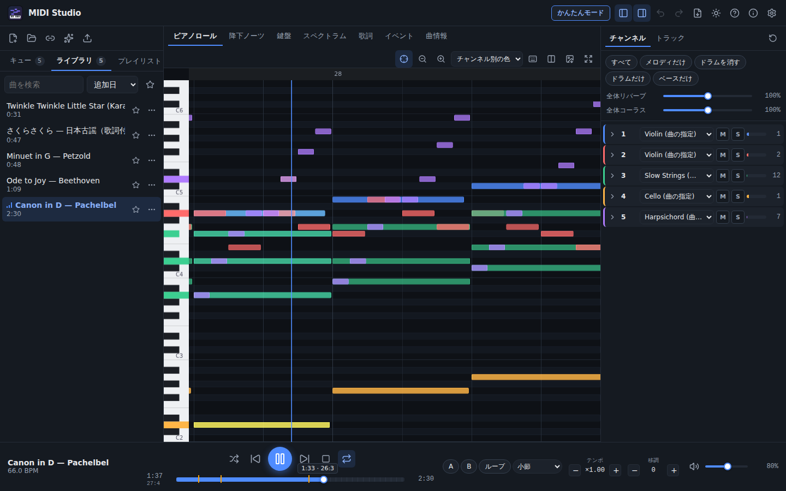
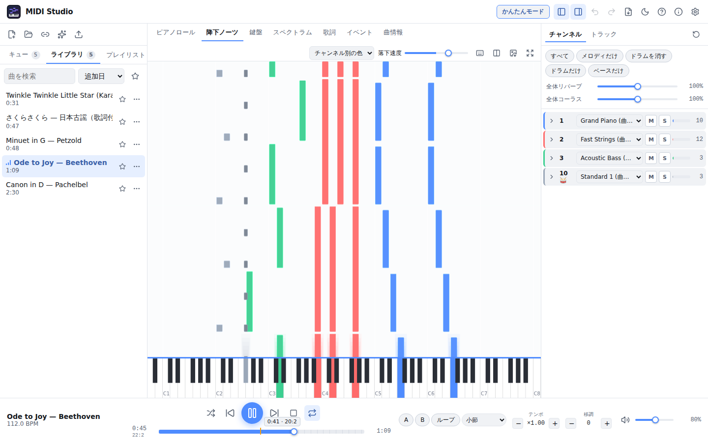
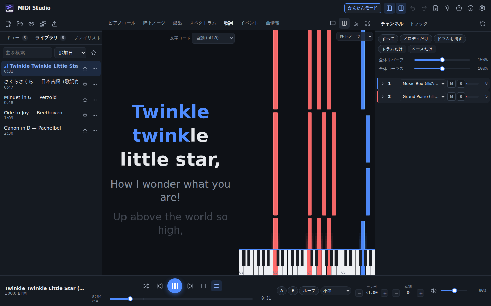
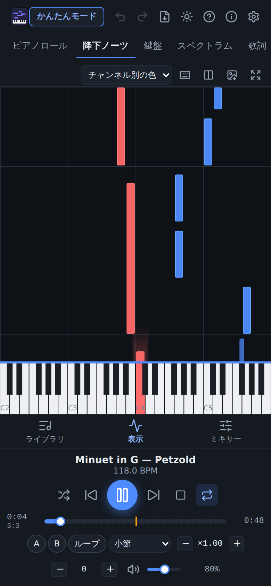
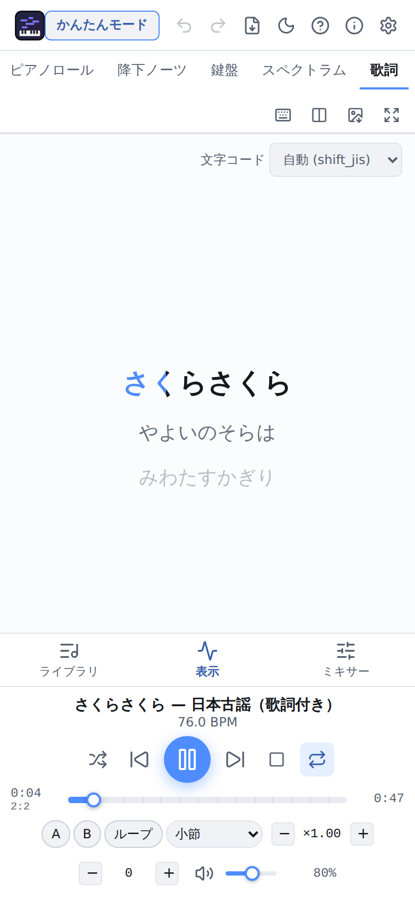
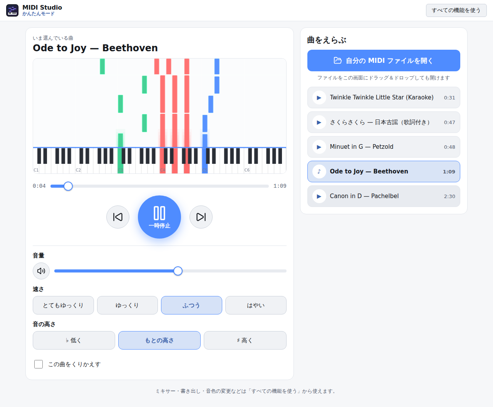
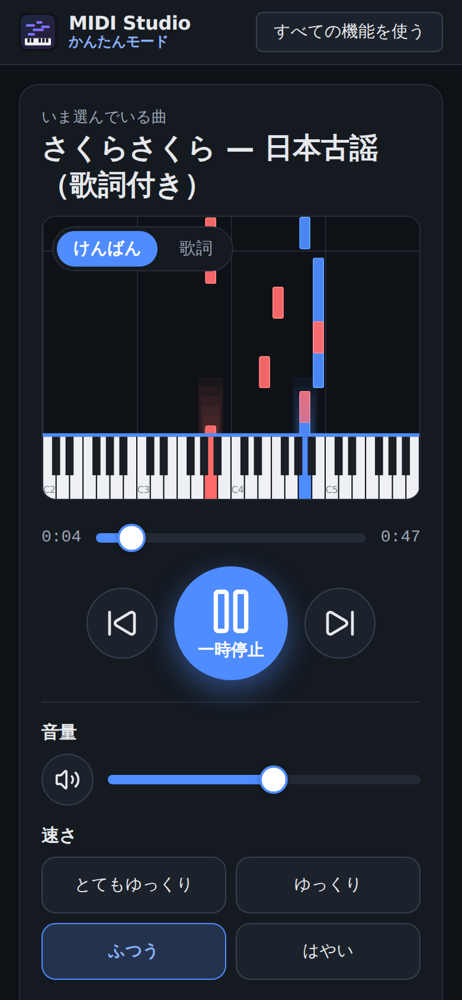

# MIDI Studio Player

ブラウザだけで動く、インストール不要の **超高機能 MIDI プレイヤー** です。
SoundFont（SF2 / SF3 / DLS）による高音質シンセで MIDI を再生し、ピアノロール・降下ノーツ・カラオケ歌詞などの多彩なビジュアライザー、16ch ミキサー、WAV 書き出し、Web MIDI、オフライン（PWA）に対応しています。完全な静的サイトなので、そのまま **Cloudflare（Workers の静的アセット / Pages）** で公開できます。

- 読み込んだファイルはすべて **ブラウザ内だけ** で処理されます（サーバーには送信されません）
- 日本語 / 英語 UI（ブラウザの言語に合わせて自動選択）
- PC・タブレット・スマホ対応、ダーク / ライト / システム連動テーマ



| ライトテーマ: 降下ノーツ | 画面分割: カラオケ歌詞 + 降下ノーツ |
| --- | --- |
|  |  |

| スマホ（ダーク） | スマホ（ライト）: Shift_JIS 歌詞 |
| --- | --- |
|  |  |

---

## かんたんモード（初心者向け）

ヘッダーの **「かんたんモード」** ボタン、または `/simple` を開くと、ボタンを大きくして操作をしぼった画面に切り替わります（設定は保存され、次回もかんたんモードで開きます）。

- 「曲をえらぶ → 大きな ▶ ボタン → 音量・速さ・音の高さをボタンで調節」の 3 ステップ
- 速さは「とてもゆっくり / ゆっくり / ふつう / はやい」、音の高さは「低く / もとの高さ / 高く」のボタン
- 表示は降下ノーツ（鍵盤）と、歌詞がある曲では歌詞の切り替えだけ
- ライブラリ・SoundFont・設定はフル機能版と共通。「すべての機能を使う」でいつでも戻れます（`?mode=full` でも可）

| デスクトップ | スマホ |
| --- | --- |
|  |  |

## 機能一覧

### 読み込み
- ドラッグ＆ドロップ（ファイル・複数ファイル・**フォルダー**）、ファイル選択、フォルダー選択
- URL から読み込み（`?url=https://…` にも対応。CORS で失敗した場合は理由と対処を表示）
- `.mid` `.midi` `.smf` `.kar` `.rmi`（RMIDI・埋め込み SoundFont 対応）、`.xmf`、`.zip`（中の MIDI / SoundFont をまとめて追加）
- デモ曲 5 曲（パブリックドメイン曲の自作打ち込み。Shift_JIS 歌詞付きの「さくらさくら」、KAR 形式の「きらきら星」を含む）
- 壊れた / 変則的なファイルにも寛容（ランニングステータス、不正なチャンク長、End of Track の欠落など）

### 再生エンジン（spessasynth_lib / AudioWorklet）
- 再生 / 一時停止 / 停止 / シーク（シーク時にプログラム・CC・ピッチベンドを正しく復元）
- 前 / 次の曲、リピート（なし・1 曲・全曲）、シャッフル
- **テンポ倍率 0.25×〜4×**（音程は不変）、**移調 ±24 半音**、マスターチューニング A4 = 415〜466 Hz
- **A-B ループ**、**小節単位ループ**（1 / 2 / 4 / 8 / 16 小節）、ループ回数指定
- マスター音量、リミッター、リバーブ / コーラス量
- GM / GM2 / GS / XG の自動判別と手動固定
- 最大発音数の設定、負荷に応じた自動削減（`renderCapacity` 対応ブラウザ）、ブラック MIDI モード自動切替
- 曲間フェード（0〜10 秒、0 でギャップなし連続再生）
- バックグラウンドタブでも途切れない（AudioWorklet で処理）

### SoundFont
- 既定: **GeneralUser GS v2.0.3（SF3 / 8.0 MiB）** ― Cloudflare Pages の 25 MiB 制限内
- SF2 / SF3 / DLS を追加して IndexedDB に保存、複数を重ねて使用（優先順位・バンクオフセット）
- チャンネルごとの音色差し替え（任意のバンク / プリセットに固定）
- 読み込み進捗の表示（読み込み中も UI は操作可能）

### ミキサー（最大 64ch = 16ch × 4 ポート）
- チャンネルごと: ミュート / ソロ / 音量 / パン / リバーブ送り / コーラス送り / 移調 / 音色 / ドラム切替 / 出力先
- リアルタイムのレベルメーターと発音数
- トラック単位のミュート / ソロ
- ワンタップのプリセット（メロディだけ / ドラムを消す / ドラムだけ / ベースだけ）

### ビジュアライザー（タブ切替・画面分割・全画面）
1. **ピアノロール**（WebGL2 / Canvas 2D フォールバック、ズーム、追従 / 手動スクロール、ベロシティ表現、ノート詳細のツールチップ、音名表示）
2. **降下ノーツ**（Synthesia 風、88 鍵と連動、打鍵エフェクト、鍵盤をクリック / タッチで演奏）
3. **16ch 鍵盤**（チャンネルごとの打鍵状態）
4. **スペクトラム / オシロスコープ / スペクトログラム**
5. **歌詞 / カラオケ**（KAR と SMF Lyric、Shift_JIS / UTF-8 / EUC-JP / Latin-1 などを自動判別、手動切替可、1 文字ずつのワイプ表示）
6. **イベントリスト**（全イベント、種類・チャンネル・トラックの絞り込み、検索、クリックでジャンプ、仮想スクロール）
7. **曲情報**（タイトル・著作権・マーカー・テンポ / 拍子グラフ・調・使用音色・トラック一覧・統計）

配信用表示: `?obs=1` を付けて開くと UI を隠し、背景透過で表示します（OBS のブラウザソース向け。ダブルクリックで再生 / 停止）。

### ライブラリ / プレイリスト
- IndexedDB に曲を保存（曲名・長さ・追加日・再生回数・お気に入り）、検索・並べ替え
- 再生キュー（ドラッグで並べ替え）、複数プレイリスト
- **M3U / JSON** の書き出し・読み込み
- 前回の曲と位置から再開

### 外部 MIDI / 入力
- **Web MIDI 出力**（チャンネルごとに出力先を指定、GM / GS / XG / GM2 リセット送信）
- **Web MIDI 入力**（MIDI キーボードで内蔵シンセを演奏、曲に重ねて演奏可）
- 演奏の **録音** → SMF としてライブラリに保存
- 画面上の鍵盤、PC キーボードでの演奏（`K` で切替）

### 書き出し
- **WAV**（44.1 / 48 / 96 kHz、16 / 24 bit・32 bit float、ノーマライズ、進捗表示とキャンセル）
- **ステム**（16 チャンネル別のドライ音声を ZIP で）
- 編集（移調・テンポ・ミュート・音色差し替え）を反映した **SMF**、元の MIDI
- ピアノロールの **PNG**

### 操作性
- キーボードショートカット（下表）、Media Session API（ロック画面・ハードウェアキー）
- 共有 URL（`?url=&t=&tempo=&transpose=`）
- ミキサーと設定の **Undo / Redo**、設定の書き出し / 読み込み（JSON）
- アクセントカラー選択、`prefers-reduced-motion` 対応、キーボードだけで全操作可能

### PWA / オフライン
- インストール可能（manifest・各サイズのアイコン）、アプリ本体はプリキャッシュ
- SoundFont は初回取得後に CacheStorage へ保存 → 2 回目以降はオフラインで再生可能
- ファイルハンドラー（インストール後、`.mid` をアプリで開ける）、Web Share Target
- 新バージョンがあると「再読み込みで更新」を表示

## キーボードショートカット

| キー | 動作 |
| --- | --- |
| `Space` | 再生 / 一時停止 |
| `←` / `→` | 5 秒戻る / 進む |
| `Shift` + `←` / `→` | 1 小節戻る / 進む |
| `↑` / `↓` | 音量を上げる / 下げる |
| `[` / `]` | テンポを下げる / 上げる |
| `-` / `=` | 半音下げる / 上げる |
| `M` | ミュート |
| `L` | ループ切替（未設定なら現在の小節をループ） |
| `A` / `B` | ループ開始点 / 終了点 |
| `Esc` | ダイアログを閉じる / ループ解除 |
| `F` | 全画面 |
| `N` / `P` | 次の曲 / 前の曲 |
| `1`〜`9` | チャンネル 1〜9 をソロ |
| `0` | ソロを全解除 |
| `K` | PC キーボード演奏モード（下段 `Z`〜`/` = C3〜、上段 `Q`〜`]` = C4〜） |
| `Ctrl` + `O` | ファイルを開く |
| `Ctrl` + `Z` / `Ctrl` + `Shift` + `Z` | 元に戻す / やり直す |
| `?` | ショートカット一覧 |

## ローカル開発

必要なもの: Node.js 22（`.nvmrc`）

```bash
npm ci
npm run dev          # 開発サーバー http://localhost:5173
npm run build        # 型チェック → 本番ビルド（dist/）→ Cloudflare Pages の制限チェック
npm run preview      # dist/ を http://localhost:4173 で配信
```

品質チェック:

```bash
npm run lint         # ESLint
npm run format:check # Prettier
npm run typecheck    # TypeScript（strict）
npm test             # Vitest（ユニットテスト）
npm run test:e2e     # Playwright（npm run build 済みの dist/ を使用）
npm run check:pages  # dist/ が 1 ファイル 25 MiB 未満・20,000 ファイル未満か確認
```

Playwright のブラウザをダウンロードできない環境では、既存の Chromium を `CHROMIUM_PATH` で指定できます。

```bash
CHROMIUM_PATH=/path/to/chrome npm run test:e2e
```

その他のスクリプト:

- `npm run gen:demo` … デモ MIDI（`public/demo/`）を再生成
- `npm run gen:icons` … アイコン・OGP 画像を SVG から再生成（Chromium が必要）
- `node scripts/screenshots.mjs` … README 用スクリーンショットを撮影（preview 起動中に実行）

## Cloudflare へのデプロイ

出力先は `dist/` です。`wrangler.toml` は **Workers の静的アセット** として配信する設定（`[assets] directory = "./dist"`、SPA フォールバック付き）になっています。`public/_headers`（CSP・キャッシュ設定など）と `public/_redirects` はビルド時に `dist/` へコピーされ、Workers / Pages のどちらでも解釈されます。

### A. ダッシュボードの Git 連携（推奨）

1. Cloudflare ダッシュボード → **Workers & Pages** → **Create** → **Import a repository** でこのリポジトリを選択
2. ビルド設定
   - Build command: `npm run build`
   - Deploy command: `npx wrangler deploy`（既定のまま）
   - 環境変数（ビルド）: `NODE_VERSION` = `22`
3. **Deploy**

`main` への push で本番に、それ以外のブランチ / PR ではプレビュー版が自動でデプロイされます。公開 URL は `https://midi2.<アカウントのサブドメイン>.workers.dev/`（独自ドメインも設定可能）。

> 旧来の **Pages**（Create → Pages → Connect to Git）で作る場合は、Build command `npm run build`、Build output directory `dist` を指定してください（Deploy command は不要）。

### B. Wrangler で直接デプロイ

```bash
npx wrangler login
npm run deploy         # = npm run build && wrangler deploy（Workers）
npm run deploy:pages   # Pages プロジェクトに出す場合（CF_PAGES_PROJECT で名前を指定、既定 midi2）
```

GitHub Actions から自動デプロイする場合は、リポジトリの **Settings → Secrets and variables → Actions** に次を登録します（未登録ならデプロイジョブは自動でスキップされます）。

- `CLOUDFLARE_API_TOKEN` … 「Workers Scripts: Edit」権限を持つ API トークン
- `CLOUDFLARE_ACCOUNT_ID` … アカウント ID

`.github/workflows/ci.yml` は PR ごとに lint / format / typecheck / unit / build / check:pages / E2E を実行し、Secrets がある場合のみ `cloudflare/wrangler-action` でデプロイします（PR はプレビュー版のアップロード、`main` は本番）。

> A と B を両方使うと二重にデプロイされます。どちらか一方を選んでください。
>
> 公開 URL が `https://midi2.pages.dev/` 以外になる場合（workers.dev や独自ドメインの場合）は、`index.html` の canonical / OGP、`public/robots.txt`、`public/sitemap.xml` の URL を書き換えてください。

## 設計判断

- **技術スタック**: Vite + TypeScript（strict）+ Preact + Preact Signals。UI は軽量な Preact、状態は Signals で再描画を最小化。
- **音源**: `spessasynth_lib` の `WorkletSynthesizer`（AudioWorklet）と `Sequencer`。MIDI の解析も同ライブラリのパーサー（`spessasynth_core`）を Web Worker 内で使い、ノート・イベント・テンポマップを typed array（構造体配列）にして転送。
- **初回表示の速さ**: シンセエンジン（約 400 KB）、各ビジュアライザー、書き出し、Web MIDI はすべて遅延読み込み。初回の JS は **約 64 KB（gzip）**。SoundFont は最初の操作時、または読み込み完了から数秒後に先読み。
- **SoundFont のサイズ**: GeneralUser GS を SF3（Ogg Vorbis 圧縮）にした 8.0 MiB 版を同梱し、Cloudflare Pages の 25 MiB 制限に収めた。分割や R2 は不要と判断。より大きな SoundFont はユーザーが追加でき、IndexedDB に保存される。
- **描画**: ピアノロールと降下ノーツは WebGL2 のインスタンス描画で矩形を一括描画（使えない環境では Canvas 2D）。文字や鍵盤は 2D キャンバスを重ねる。表示に関わる値が変わらないフレームは描画を省略して、停止中の CPU / GPU 負荷を抑える。
- **曲間の「クロスフェード」**: 1 つのシンセで曲を切り替えるため、厳密な重ね合わせ（2 曲同時発音）ではなく「曲末のフェードアウト → 次曲のフェードイン」として実装。2 曲同時に鳴らすには SoundFont を 2 つ読み込む必要があり、メモリ消費が倍になるため見送った。
- **ステム書き出し**: シンセのチャンネル別出力はドライ音（リバーブ / コーラスは全体で 1 系統）なので、ステムはエフェクトなし。通常の WAV はエフェクト込み。
- **SharedArrayBuffer を使わない**: COEP（`require-corp`）を有効にすると、URL 読み込み（他サイトのファイル取得）と両立しないため。AudioWorklet と MessagePort だけで実装し、COOP のみ設定。
- **CSP**: スクリプトは自サイトのみ（`'wasm-unsafe-eval'` のみ許可）。URL 読み込みのため `connect-src` は `https:` を許可。インライン style は Preact のスタイル属性のため許可。
- **Service Worker**: `vite-plugin-pwa`（injectManifest）で独自 SW を作成。アプリ本体はプリキャッシュ、SoundFont は CacheFirst で保存し、初回訪問時も SW が有効になった時点で先にキャッシュする。Share Target の POST も SW で受ける。
- **負荷対策**: AudioContext の負荷 API（`renderCapacity`）があれば、アンダーラン時に発音数上限を自動で下げる。低スペック端末（CPU 4 コア以下など）では初期上限を 128 に。40 万ノート超ではブラックMIDIモード。
- **文字コード**: UTF-8 として厳密に妥当か → Shift_JIS / EUC-JP の構造スコア → Windows-1252 の順で推定。曲ごとに手動で切り替え可能。
- **データの扱い**: 外部への送信は一切なし（URL 読み込み時の取得のみ）。分析・解析用のトラッキングも入れていない。

## ディレクトリ構成

```
public/            静的ファイル（SoundFont、デモ、アイコン、_headers、_redirects、robots.txt、sitemap.xml）
src/audio/         シンセエンジン、プレイヤー制御、書き出し、Web MIDI、録音、WAV エンコーダー
src/midi/          解析（Worker）、文字コード推定、歌詞、SMF 編集、イベント整形、GM 音色名
src/visual/        ピアノロール、降下ノーツ、鍵盤、スペクトラム、歌詞、イベントリスト、曲情報
src/library/       IndexedDB、プレイリスト / M3U / JSON
src/state/         Signals ストア、設定、ミキサー状態、Undo / Redo、通知
src/ui/            コンポーネント、ショートカット、テーマ、i18n（locales/ja.json, en.json）
src/sw.ts          Service Worker
tests/unit/        Vitest
tests/e2e/         Playwright
scripts/           デモ生成、アイコン生成、スクリーンショット、Pages 制限チェック
LICENSES/          同梱ソフトウェア・素材のライセンス
```

## ライセンス / クレジット

- **spessasynth_lib / spessasynth_core** — © Spessasus, Apache License 2.0（`LICENSES/spessasynth_lib-Apache-2.0.txt`）
- **GeneralUser GS v2.0.3** — © S. Christian Collins。自由に利用・再配布できる SoundFont（`LICENSES/GeneralUser-GS.txt`）。SF3 版は SpessaSynth プロジェクトが配布しているもの。
- Preact / @preact/signals（MIT）、idb（ISC）、fflate（MIT）、Lucide（ISC）、Workbox（MIT）
- デモ曲: ベートーヴェン「歓喜の歌」、ペツォールト「メヌエット ト長調」、パッヘルベル「カノン」、日本古謡「さくらさくら」、「きらきら星」― いずれもパブリックドメイン曲を本プロジェクトのために打ち込んだもので、CC0 1.0 とします。

詳細は `LICENSES/THIRD_PARTY.txt` を参照してください。アプリ内の「このアプリについて」からも確認できます。
